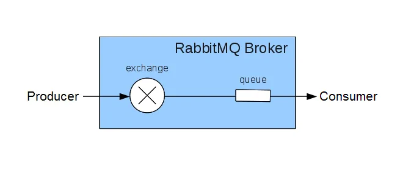

# What is a Message Queue?

Message queuing allows applications to communicate by sending messages to each other. The Message queue provides temporary message storage when the destination program is busy or not connected.

A message queue is made up of a "**producer**", a "**broker**", and a "**consumer**".

A message queue provides an asynchronous communication between applications.

